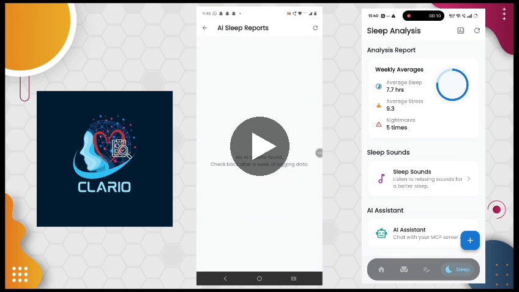

# Clario

[](docs/assets/clario_features_highlight.mp4)

**🎥 [Watch a 1:45 walkthrough of both features](docs/assets/clario_features_highlight.mp4)** — Sleep Analysis
first, then the Empty Chair dialogue end-to-end, recorded straight from the running app.
(Click the image above or the link — GitHub plays `.mp4` files inline once you're viewing the file.)

Clario is a youth mental wellness app built around two core features:

1. **[Empty Chair](./empty-chair)** — a guided, AI-facilitated implementation of the
   Gestalt "Empty Chair" technique. Users have a structured dialogue with an
   imagined person/feeling ("RED Chair") and themselves ("BLUE Chair"), with an
   AI facilitator (Gemini) guiding the session, a pre-analysis phase to surface
   the core emotion before the dialogue starts, and long-term memory (RAG over
   past session summaries) so recurring themes can be referenced in future
   sessions.

2. **[Sleep Wellness (MCP)](./sleep-wellness-mcp)** — a sleep-tracking and
   coaching feature. A Postgres-backed dataset of nightly sleep data is
   analyzed by an ADK agent that talks to a custom MCP (Model Context
   Protocol) toolset, and push notifications (FCM) are sent for sleep
   interventions/recommendations.

Both features were built as Google Cloud Functions (Python, `functions-framework`)
plus supporting agent/server code, with Firestore as the session store for
Empty Chair and Cloud SQL (Postgres) for sleep data.

## Repo layout

```
clario/
├── empty-chair/            # Cloud Functions for the Empty Chair feature
└── sleep-wellness-mcp/
    ├── functions/           # Cloud Functions: sleep analysis + notifications
    └── agent/               # ADK agent + FastAPI wrapper that talks to the MCP server
```

## ⚠️ Before you deploy

This code was pulled out of a working prototype. A few things to do before
running it anywhere beyond your own machine:

- **Secrets**: nothing in this repo should contain real credentials. Set
  `PGPASSWORD`, `PGHOST`, `PGUSER`, `PGDATABASE`, `PROJECT_ID`, etc. via
  environment variables / Secret Manager — never commit real values.
- **Firebase/GCP service accounts**: deploy with a service account that has
  the minimum Firestore/Vertex AI/Cloud SQL permissions needed, not broad
  project-owner access.
- Each subfolder has its own README with deploy commands and required env vars.
